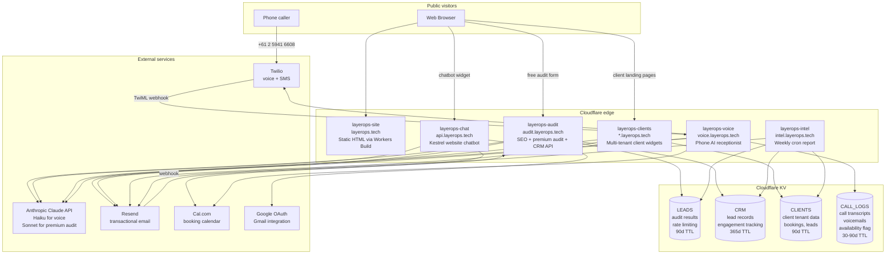
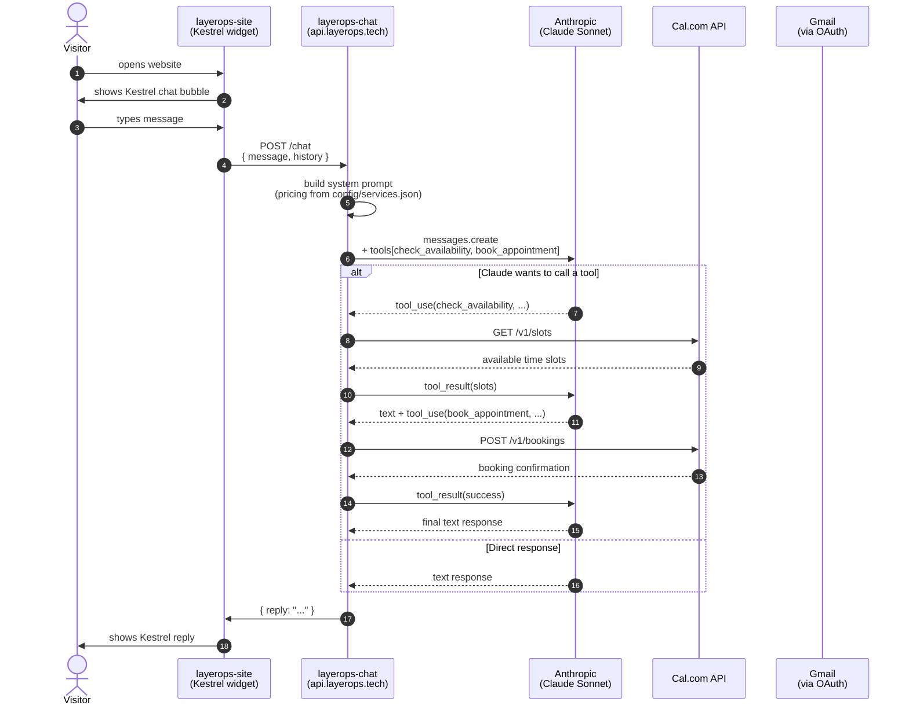
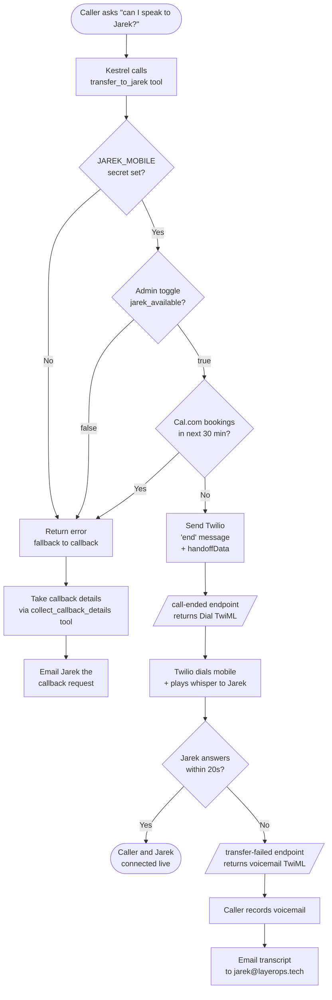
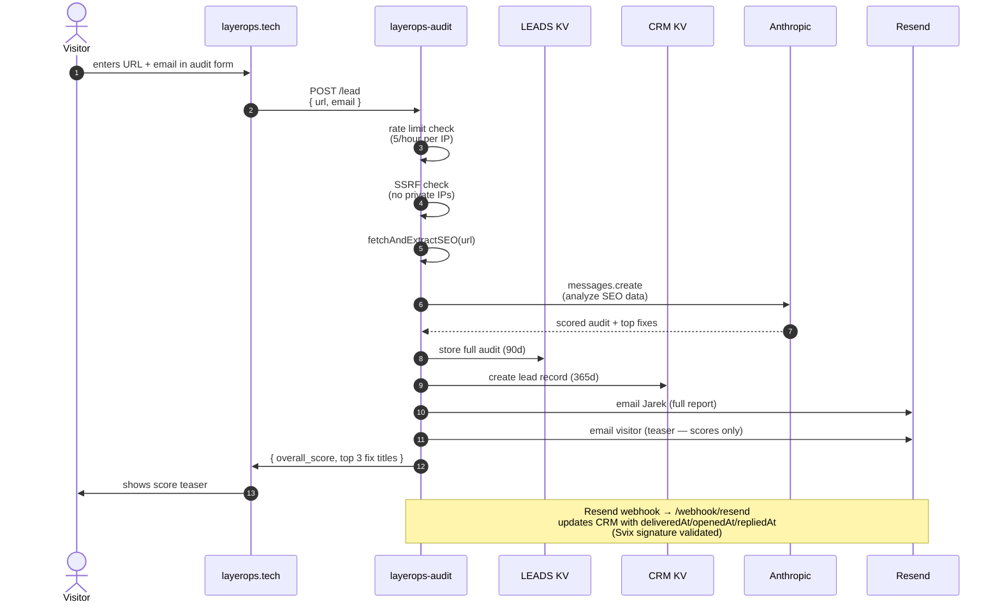
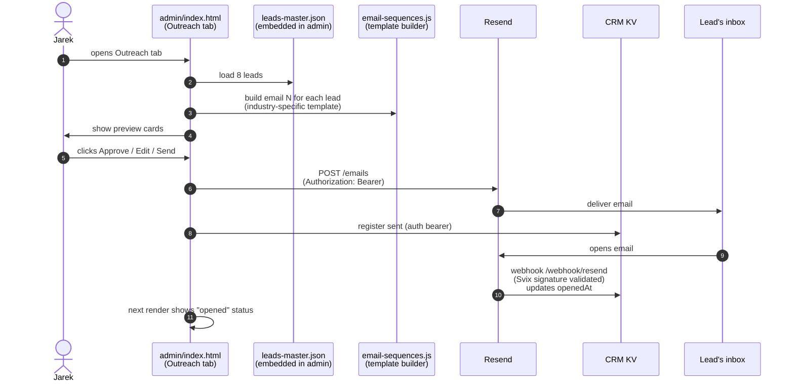
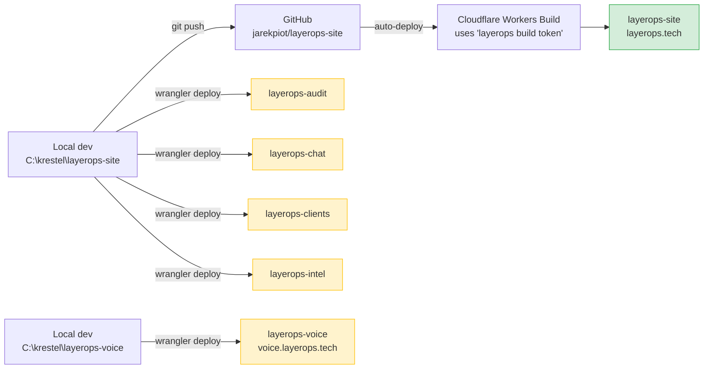
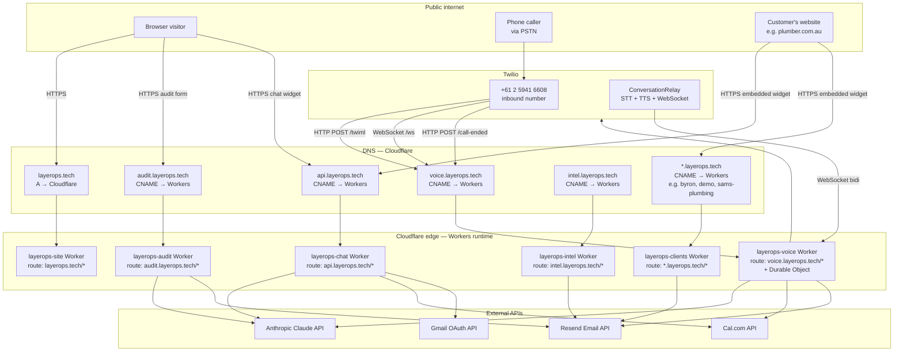
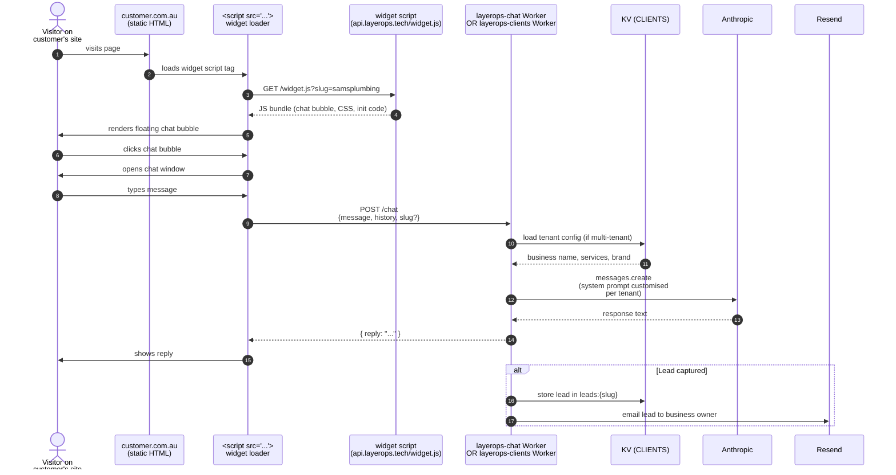
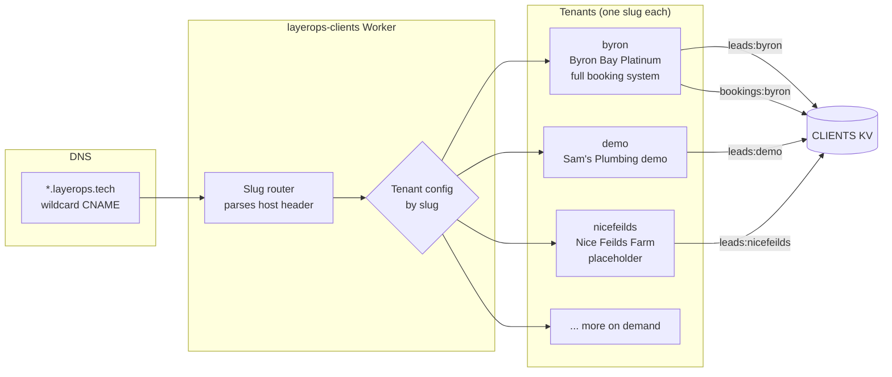

# LayerOps — System Architecture

> Version: 2026-04-07 · Maintained by: Jarek Piotrowski
>
> If you're a future Claude session reading this: **start here** before doing any non-trivial work. This document describes how every piece of LayerOps fits together. Pair this with `WORKFLOW.md` (the change methodology) and `CREDENTIALS.md` (the credentials inventory).

---

## What LayerOps is

LayerOps is an AI automation business for Australian small businesses. Founded by Jarek Piotrowski (Canberra). The product is "an AI receptionist that catches every customer enquiry":

- **Starter (from $99/mo)** — Website chatbot, captures enquiries 24/7, books appointments
- **Professional (from $299/mo)** — Voice AI receptionist + chatbot, every channel answered 24/7
- **Operator (from $599/mo)** — Everything in Professional + email triage, review automation, monthly strategy

The technology stack is intentionally simple: **Cloudflare Workers + KV** for everything. No databases, no auth servers, no Kubernetes. The website is static HTML deployed via Workers Builds. Each Worker has a single responsibility.

---

## High-level system architecture



---

## Component reference

### 1. `layerops-site` — the public website
- **URL:** `https://layerops.tech`
- **Source:** `C:\krestel\layerops-site\` (everything except the `workers/` and `layerops-voice/` subfolders)
- **Type:** Static HTML served by a Worker (Workers Builds — auto-deploys from GitHub on push to `master`)
- **Auth:** None — public
- **Pages:** `/` (homepage), `/pricing`, `/automation`, `/demo/`, `/blog/`, `/checklist`, `/admin/` (password-protected client side, real auth lives in the audit worker)
- **Build trigger:** "layerops build token" connected to the GitHub repo via Workers Builds
- **Single source of truth for pricing:** `config/services.json`

### 2. `layerops-audit` — the SEO audit + CRM API
- **URL:** `https://audit.layerops.tech`
- **Source:** `C:\krestel\layerops-site\seo-audit-worker.js`
- **Wrangler:** `wrangler-audit.toml`
- **Bindings:** `LEADS`, `CRM` KV namespaces, `BROWSER` (Cloudflare Browser Rendering for screenshots)
- **Secrets:** `ANTHROPIC_API_KEY`, `RESEND_API_KEY`, `RESEND_WEBHOOK_SECRET`, `CRM_AUTH_TOKEN`
- **Endpoints:**
  - `POST /` — basic audit (HTML scrape + Claude analysis)
  - `POST /premium` — premium audit (3-pass: technical + copy + visual)
  - `POST /visual` — visual analysis only (browser screenshot + Claude vision)
  - `POST /lead` — lead capture form on the homepage
  - `GET/POST /crm/leads`, `/crm/add`, `/crm/update`, `/crm/save-audit`, `/crm/get-audit`, `/crm/follow-ups` — **all require Bearer auth via `CRM_AUTH_TOKEN`**
  - `POST /webhook/resend` — receives delivery/open/click/bounce events from Resend (Svix signature validated)
- **Rate limiting:** 5 requests/hour per IP via KV (premium audit consumes 3 slots)
- **SSRF protection:** rejects URLs targeting private IPs, loopback, link-local, cloud metadata endpoints

### 3. `layerops-chat` — Kestrel website chatbot
- **URL:** `https://api.layerops.tech`
- **Source:** `C:\krestel\layerops-site\layerops-worker.js`
- **Wrangler:** `wrangler-chat.toml`
- **Bindings:** none
- **Secrets:** `ANTHROPIC_API_KEY`, `CAL_COM_API_KEY`, `CAL_EVENT_TYPE_ID`, `GOOGLE_CLIENT_ID`, `GOOGLE_CLIENT_SECRET`, `GOOGLE_REFRESH_TOKEN`
- **Endpoints:** `POST /chat` — proxies user message to Claude with the Kestrel system prompt and tool definitions (`check_availability`, `book_appointment`)
- **Pricing:** quoted from the system prompt (manually kept in sync with `config/services.json`)

### 4. `layerops-voice` — phone AI receptionist
- **URL:** `https://voice.layerops.tech`
- **Source:** `C:\krestel\layerops-voice\` (separate folder, separate git repo, sibling to layerops-site)
- **Wrangler:** `wrangler.toml`
- **Bindings:** `CALL_LOGS` KV, `VOICE_SESSION` Durable Object
- **Secrets:** `ANTHROPIC_API_KEY`, `TWILIO_ACCOUNT_SID`, `TWILIO_AUTH_TOKEN`, `CAL_COM_API_KEY`, `RESEND_API_KEY`, `JAREK_MOBILE`
- **Endpoints:**
  - `POST /twiml` — Twilio webhook on inbound call. Returns TwiML that opens a `<ConversationRelay>` to the WebSocket endpoint.
  - `WS /ws` — Twilio Media Streams WebSocket. Each call gets a Durable Object (`VoiceSession`) that runs the conversation.
  - `POST /call-ended` — Twilio session end callback. **Branches on `HandoffData`:** if a transfer was requested, returns `<Dial>` TwiML to bridge the call to Jarek's mobile.
  - `POST /twiml/transfer-failed` — Twilio fallback when Jarek doesn't pick up. Returns voicemail TwiML.
  - `GET /twiml/whisper?name=...` — Played to Jarek when he picks up the bridged call. Announces the caller.
  - `POST /twiml/voicemail-saved` — Twilio callback after voicemail recording finishes. Saves to KV and emails Jarek the transcript.
  - `GET/POST /availability` — Read/write the manual availability toggle (used by admin dashboard).
  - `GET /health` — health check
- **Tools available to Claude:** `check_availability`, `book_appointment`, `collect_callback_details`, `transfer_to_jarek`, `save_caller_info`
- **Live call forwarding rules:** transfer happens only when (a) admin toggle is ON, (b) no Cal.com booking in next 30 minutes, (c) caller specifically asks for a human

### 5. `layerops-clients` — multi-tenant client widgets
- **URL pattern:** `https://*.layerops.tech` (e.g. `demo.layerops.tech`, `byron.layerops.tech`)
- **Source:** `C:\krestel\layerops-site\workers\client-chat\worker.js`
- **Wrangler:** `workers/client-chat/wrangler-clients.toml`
- **Bindings:** `CLIENTS` KV
- **Secrets:** `RESEND_API_KEY`, `ANTHROPIC_API_KEY`
- **What it does:** Serves a per-client chatbot widget AND a per-client landing page. Each subdomain identifies a tenant (the `slug`). Client-specific config (business name, services, pricing, brand colour, booking type) is hardcoded in the worker source per slug.
- **Built-in clients:** `byron` (Byron Bay Platinum Transfers — full booking system), `demo` (Sam's Plumbing demo), more on demand

### 6. `layerops-intel` — weekly market intelligence
- **URL:** `https://intel.layerops.tech`
- **Source:** `C:\krestel\layerops-site\workers\market-intel\worker.js`
- **Wrangler:** `workers/market-intel/wrangler-intel.toml`
- **Bindings:** `CRM`, `LEADS`, `CLIENTS` KV (read-only)
- **Secrets:** `RESEND_API_KEY`
- **Schedule:** `0 21 * * SUN` UTC = Mondays 7:00 AM AEST
- **What it does:** Pulls live pipeline data (CRM lead engagement, audit funnel, client chatbot activity), pings 6 competitor sites, generates dynamic recommendations, emails the report to `jarekpiot@gmail.com`.
- **Manual trigger:** `curl https://intel.layerops.tech/`

---

## Data stores (Cloudflare KV)

| Namespace | ID | Owners | Schema | TTL |
|---|---|---|---|---|
| **LEADS** | `67c39872b3b54da3be762600e278cc99` | audit (RW), intel (R) | `leadId` → audit results, `email:{email}` → lead ID list, `limit:email:{email}` / `limit:url:{host}` → rate limit counters, `rate:{ip}:{hour}` → per-IP rate counter | 90d (records), 1h (rate limits) |
| **CRM** | `8d44dabe6c484f30b8c5ac2d6d090280` | audit (RW), intel (R) | `lead:{id}` → CRM lead record with `deliveredAt`/`openedAt`/`repliedAt` engagement timestamps, `index:leads` → array of all lead IDs, `audit:{type}:{url}` → cached audit results | 365d |
| **CLIENTS** | `8f8f82f39ade45f2914bd9ec34ec9ea1` | clients (RW), intel (R) | `leads:{slug}` → array of leads captured by client widget, `bookings:{slug}` → array of bookings made via client widget | 90d |
| **CALL_LOGS** | `0ee6a757b4bf45f6b23bd40a478e7494` | voice (RW) | `call_{callSid}` → full call transcript + metadata, `voicemail_{callSid}` → voicemail recording URL + transcript, `transfer_{callSid}` → transfer attempt log, `caller_{phoneNumber}` → returning-caller profile, `jarek_available` → availability toggle (`true`/`false`), `handoff_{callSid}` → call handoff record | 30-90d (varies by key) |

---

## Chatbot flow (Kestrel on layerops.tech)



**Key points:**
- The chatbot is a thin proxy. Cloudflare Worker holds the secrets, browser never sees them.
- The system prompt is **hardcoded in the worker source** (not loaded from config — manual sync needed when pricing changes).
- Tools are defined inline in the worker. Claude decides when to call them.
- Booking confirmations get emailed via Gmail OAuth (not Resend, because they need to come from Jarek's actual gmail to look personal).

---

## Voice AI flow (phone calls to (02) 5941 6608)

```mermaid
sequenceDiagram
  autonumber
  actor C as Caller
  participant T as Twilio<br/>(+61 2 5941 6608)
  participant V as layerops-voice<br/>(voice.layerops.tech)
  participant DO as VoiceSession<br/>(Durable Object)
  participant Cl as Anthropic<br/>(Claude Haiku 4.5)
  participant Cal as Cal.com API
  participant K as CALL_LOGS KV
  participant J as Jarek's mobile<br/>+61404003240

  C->>T: dials number
  T->>V: POST /twiml
  V->>T: TwiML &lt;ConversationRelay url="wss://.../ws"&gt;
  T->>DO: WebSocket /ws
  DO->>K: load caller profile (if any)
  DO->>Cal: GET /v1/bookings (next 30 min)
  Cal-->>DO: bookings list
  Note over DO: jarekAvailable = (toggle ON) AND (no booking in next 30 min)
  T->>C: speaks "Thanks for calling LayerOps, this is Kestrel..."
  C->>T: speaks (audio)
  T->>DO: text via WebSocket
  DO->>Cl: messages.create (with system prompt + tools)
  Cl-->>DO: response text
  DO->>T: send text via WebSocket
  T->>C: speaks response (TTS via ElevenLabs)

  alt Caller asks "can I speak to Jarek?"
    DO->>DO: transfer_to_jarek tool
    Note over DO: requires JAREK_MOBILE secret + jarekAvailable=true
    DO->>K: log transfer attempt
    DO->>T: WebSocket "end" message<br/>+ HandoffData{action:"transfer", to:+61404003240}
    T->>V: POST /call-ended<br/>+ HandoffData
    V->>T: TwiML &lt;Dial timeout=20&gt;+61404003240&lt;/Dial&gt;<br/>action=/twiml/transfer-failed
    T->>J: rings mobile (with whisper "Incoming call from X via Kestrel")
    alt Jarek answers
      J->>C: connected
    else No answer in 20s
      T->>V: POST /twiml/transfer-failed<br/>DialCallStatus=no-answer
      V->>T: TwiML &lt;Record&gt; voicemail
      T->>C: "Sorry, looks like Yarek just stepped away..."
      C->>T: leaves voicemail
      T->>V: POST /twiml/voicemail-saved<br/>RecordingUrl + transcript
      V->>K: store voicemail
      V->>J: Resend email (transcript + recording)
    end
  end
```

**Key points:**
- Each call is its own Durable Object instance — survives restarts, isolated state per call.
- Voice is `Kestrel` (ElevenLabs). STT is Deepgram Nova-3. LLM is Claude Haiku 4.5 (chosen for latency).
- The availability check happens **once at the start of the call** in `handleSetup()`. The toggle and Cal.com state at the moment of pickup determine whether transfer is offered for the entire call.
- The whisper announcement (the "Incoming call from X via Kestrel" played to Jarek before bridging) prevents Jarek from getting confused on transfer.
- If transfer fails, the system gracefully degrades to voicemail + email, so the caller never hits a dead end.

For deeper voice-only details, see `C:\krestel\layerops-voice\ARCHITECTURE.md`.

---

## Live call forwarding decision logic



---

## Audit tool flow (free SEO audit on the homepage)



**Key points:**
- Visitor sees the score and top 3 fix **titles** but not the descriptions — that's the hook to encourage them to book a call.
- Jarek sees the **full report** with all categories, all fixes, and follow-up notes.
- Resend webhooks track engagement automatically — when the visitor opens the teaser email, it shows up in the admin CRM as "opened".
- The premium audit (`/premium`) does 3 passes (technical, copy, visual) and synthesises them into a unified score with grade and talking points.

---

## Outreach sequence flow



**Sequence steps (5-email research-backed):**
1. **Day 0** — Pain proof + verified audit finding
2. **Day 3** — Quick bump + industry stat
3. **Day 7** — Social proof / case study
4. **Day 14** — Free audit report offer
5. **Day 21** — Breakup email (highest reply rate)

---

## Deployment topology



**Key points:**
- **`layerops-site` is the only worker that auto-deploys from GitHub.** Push to `master` → Workers Build pulls the repo, deploys.
- **All other workers deploy manually** via `wrangler deploy -c <toml>` from the local terminal using the wrangler OAuth login (or the `layerops build token` if `CLOUDFLARE_API_TOKEN` env var is set).
- **`layerops-voice` lives in a separate folder** (`C:\krestel\layerops-voice`) with its own git history (no GitHub remote yet — that's a TODO).
- **Rollback per worker:** `npx wrangler rollback <version-id> -c <toml>` restores the deployed worker without changing local code.

---

## Security model

| Layer | Defence |
|---|---|
| **Network** | Cloudflare DDoS protection (free tier), automatic HTTPS, HSTS enforced via headers |
| **Worker → KV** | Cloudflare-managed; no public access to KV |
| **CRM API** | `Authorization: Bearer <CRM_AUTH_TOKEN>` required on all `/crm/*` endpoints. Constant-time string compare. |
| **Admin dashboard** | Passcode entered by user IS the bearer token sent to the worker. No client-side hash. No cleartext fallback. Failed login → 401 from worker → admin page shows login error. |
| **Resend webhooks** | Svix signature validation against `RESEND_WEBHOOK_SECRET` + 5-minute replay window. Rejects unsigned webhooks. |
| **Twilio webhooks** | HMAC-SHA1 signature validation against `TWILIO_AUTH_TOKEN`. Currently **disabled** on `layerops-voice` after a deploy regression — needs to be re-implemented carefully. (Open item, see `sessions_log.md`.) |
| **Audit URL fetching** | SSRF block: rejects private IPs, loopback, link-local, cloud metadata, internal TLDs. |
| **Rate limiting** | KV-backed per-IP, 5 requests/hour. Premium audit consumes 3 slots. |
| **CORS** | `/crm/*` restricted to `layerops.tech` and subdomains. Public audit endpoints get `*`. |
| **Security headers** | `HSTS`, `X-Frame-Options: DENY`, `X-Content-Type-Options: nosniff`, `Referrer-Policy: strict-origin-when-cross-origin` on all worker responses. |
| **Secret storage** | All secrets stored as Cloudflare Worker secrets (write-only). Never in source code, never in `.claude/settings.local.json` (now `.gitignore`d), never logged. |

For the credentials inventory and rotation playbook, see `CREDENTIALS.md`.

---

## Network & routing topology



**Key points about routing:**

- **Everything is HTTPS through the Cloudflare edge.** No origin servers, no VPS, no AWS, no GCP. The Worker IS the server.
- **No Cloudflare Tunnels (cloudflared) anywhere.** We deliberately don't use them — Workers replace the need for tunnels because the code runs on Cloudflare's network directly. There's no "tunnel from a private box to the internet" because there's no private box.
- **DNS is all managed in Cloudflare**, not Route53/GoDaddy/etc. The apex `layerops.tech` resolves directly to Cloudflare's anycast network. Subdomains are CNAMEs to `workers.dev` patterns under the hood.
- **The wildcard subdomain `*.layerops.tech`** is handled by `layerops-clients`. Any subdomain not explicitly claimed by another worker (audit/api/voice/intel) lands on the clients worker, which inspects the host header to determine the tenant slug.
- **Customer sites embed our chatbot via a `<script>` tag** that loads from `https://api.layerops.tech` (Kestrel) OR from `https://<slug>.layerops.tech/widget.js` (per-client). All requests originate from the customer's site but talk back to our infrastructure.
- **Twilio's voice traffic** comes in two flows: (1) HTTP POST webhooks (`/twiml`, `/call-ended`, etc.) that return TwiML, and (2) a WebSocket connection from Twilio's ConversationRelay to our Durable Object, carrying real-time STT text and pushing TTS responses.

---

## Customer site embed flow



**Two embed modes:**

1. **Generic Kestrel widget** — used on `layerops.tech` itself. Talks to `api.layerops.tech` (`layerops-chat` Worker). Pricing/services come from the hardcoded system prompt.

2. **Per-client widget** — used on customer sites (e.g. `samsplumbing.com.au`). Talks to `<slug>.layerops.tech` (`layerops-clients` Worker). The tenant config (business name, services, brand colour, booking type, custom prompts) lives in the worker source per slug. Each tenant gets isolated lead capture into `CLIENTS:leads:{slug}` and bookings into `CLIENTS:bookings:{slug}`.

**Customer never touches our code or our keys.** They just paste a `<script>` tag onto their site. The script loads from our domain, runs in their visitor's browser, and POSTs back to our worker. No CORS issues because the worker explicitly allows the customer's origin (or `*` for the chatbot endpoint).

---

## Multi-tenant client deployment (the `*.layerops.tech` model)



**How a request flows:**

1. Visitor goes to `byron.layerops.tech/landing` (or similar)
2. DNS resolves to Cloudflare
3. Cloudflare matches the route `*.layerops.tech/*` → routes to `layerops-clients` Worker
4. Worker reads `request.headers.host` → extracts `byron`
5. Worker validates the slug against a regex `/^([a-z0-9-]+)\.layerops\.tech$/i`
6. Worker looks up the tenant config for `byron` (currently hardcoded in worker source — not in KV)
7. Worker serves the appropriate response: landing page HTML, chatbot widget JS, booking form, payment page, etc. — all branded with the tenant's business name and colours
8. Lead/booking data is written to `CLIENTS` KV under tenant-prefixed keys (`leads:byron`, `bookings:byron`) so tenants can never see each other's data

**Adding a new client takes ~5 minutes:**
1. Add a new tenant config block in `workers/client-chat/worker.js`
2. `npx wrangler deploy -c workers/client-chat/wrangler-clients.toml`
3. Tell the customer to point a CNAME (or just use the new subdomain `theirslug.layerops.tech`)
4. They embed the widget script on their existing site OR use our hosted landing page directly

---

## What we deliberately do NOT use

| Tool | Why we don't use it |
|---|---|
| **Cloudflare Tunnels (cloudflared)** | Workers replace the need entirely. Tunnels are for exposing private boxes (your laptop, a VPS) to the internet via Cloudflare. We have no private boxes. |
| **AWS / GCP / Azure / DigitalOcean** | Same reason. Workers + KV cover everything we need at this scale. No reason to add a second cloud provider with separate billing, separate auth, separate security model. |
| **Containers (Docker / Kubernetes)** | Workers are the container. They scale automatically, deploy in seconds, and have no maintenance overhead. |
| **A traditional database (Postgres, MySQL)** | KV handles all our needs. If we ever need relational queries, Cloudflare D1 is the next step (still no separate provider). |
| **Auth0 / Clerk / Supabase Auth** | We don't have customer accounts. The admin uses a single shared passcode. The chatbot is stateless. |
| **CDN (separate)** | Cloudflare IS the CDN. Workers run on the same edge nodes that cache static assets. |
| **VPN / WireGuard** | Nothing private to access. Everything is on the public Cloudflare edge with worker-level auth where needed. |
| **An app server (Express, Fastify, NestJS)** | Each worker IS the app server. ~1000 lines per worker max. |
| **A monorepo build system (Turborepo, Nx)** | Each worker has one wrangler.toml and deploys independently. No build orchestration needed. |

The architectural philosophy: **fewest moving parts that can deliver the product**. Every additional service is a credential to leak, a bill to pay, and a thing that can break at 3am.

---

## Scaling & concurrency

**The voice bot handles many calls in parallel.** Each inbound call creates its own `VoiceSession` Durable Object instance — isolated state, no shared memory, no race conditions between calls. Cloudflare provisions new DO instances on demand.

**Real-world limits in order of which you hit first:**

| Limit | Default | Effective ceiling | Notes |
|---|---|---|---|
| Twilio concurrent calls per number | **30** | Can be raised by Twilio support | Hard limit if not raised |
| Anthropic API rate limit (new account) | ~50 req/min | Raisable on request | A single 3-min call uses ~10-20 requests, so ~5 concurrent calls hits this |
| Cloudflare Worker requests | ~6,000/min per script (Free tier) | Workers Paid tier removes this | Not a real limit at LayerOps scale |
| Cloudflare Durable Object concurrent instances | Effectively unlimited | n/a | This is what makes the voice bot scale |
| Cal.com API | ~120 req/min | Raisable on Cal.com plans | Only hit by booking-heavy traffic |
| Cost (Twilio + Anthropic + Deepgram) | ~$0.044 USD/min all-in | n/a | 30 concurrent calls × 5 mins = $6.60/hr USD. Not a hard limit but worth alerting on. |

**At LayerOps' current stage (zero paying customers), practical concurrency = unlimited.** At 100 customers averaging 5 calls/day, expected peak concurrency is 10-15 calls — well within all limits **except** Anthropic's default rate limit, which would need to be raised via the Anthropic console (one form, ~24 hour turnaround).

**The first thing that would break under load is Anthropic rate limits**, not Cloudflare. There's no architectural rewrite needed — just a paperwork request.

---

## What's NOT built (intentional gaps)

- **No user accounts / customer login** — every customer is onboarded by Jarek manually, the chatbot is the customer-facing entry point
- **No payment processing on the website** — bookings happen via Cal.com, payments handled out-of-band
- **No CI/CD beyond the auto-deploy** — manual `wrangler deploy` for the workers
- **No staging environment** — workers deploy straight to production. The 9-step workflow + version-ID rollback is the safety net.
- **No session management on the chatbot** — each chat is stateless, conversation history only lives in the browser
- **No database** — KV is the only data store. If we ever need relational queries, D1 is the next step.

---

## Where to find each thing

| What | Where |
|---|---|
| Pricing config | `config/services.json` |
| Workflow methodology | `WORKFLOW.md` |
| Session start instructions for Claude | `CLAUDE.md` |
| Credentials inventory | `CREDENTIALS.md` |
| Voice worker source | `C:\krestel\layerops-voice\src\` |
| Voice worker architecture detail | `C:\krestel\layerops-voice\ARCHITECTURE.md` |
| Voice worker rollback procedure | `C:\krestel\layerops-voice\ROLLBACK.md` |
| Admin dashboard | `admin/index.html` (single file) |
| Outreach sequence templates | `tools/email-sequences.js` |
| Outreach sequence runner | `tools/outreach-sequence.js` |
| Sales scout | `tools/scout.js` |
| Memory (Claude auto-loaded) | `~/.claude/projects/C--krestel-layerops-site/memory/` |
